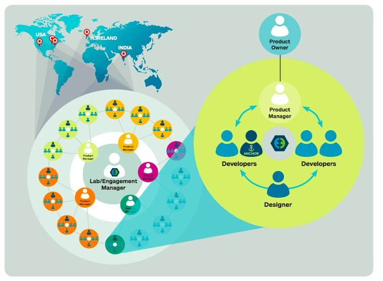
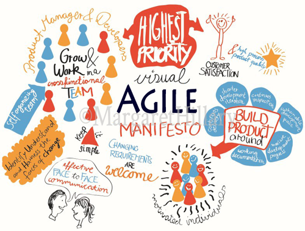
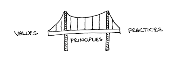
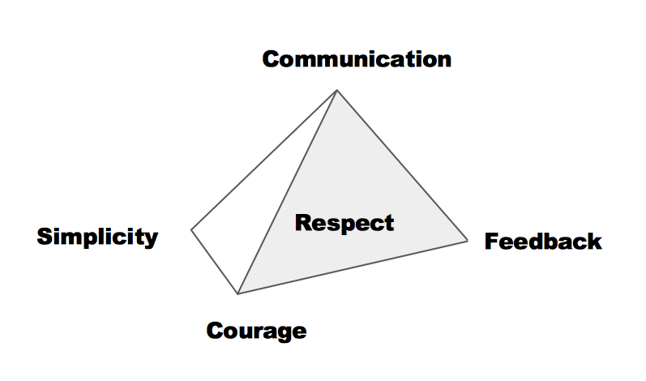
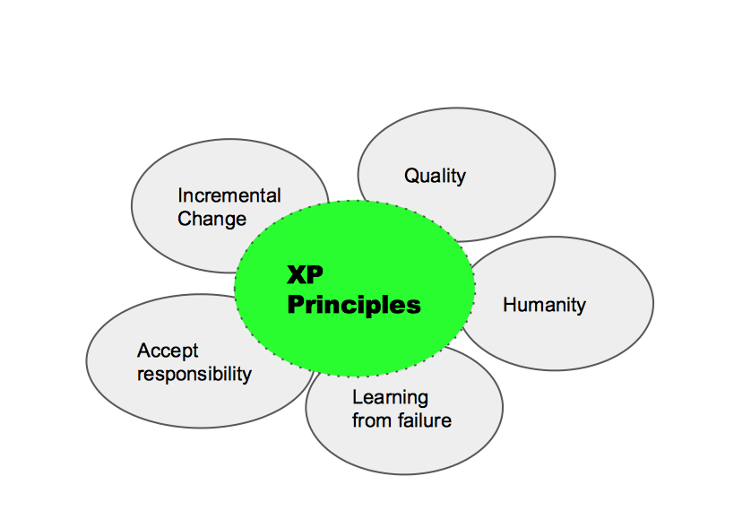
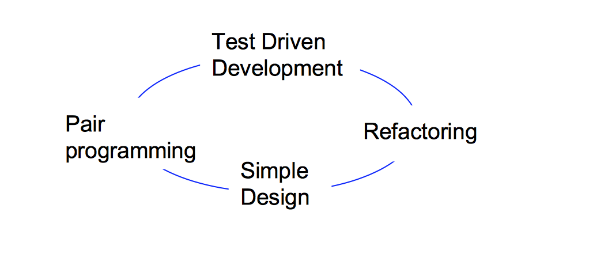
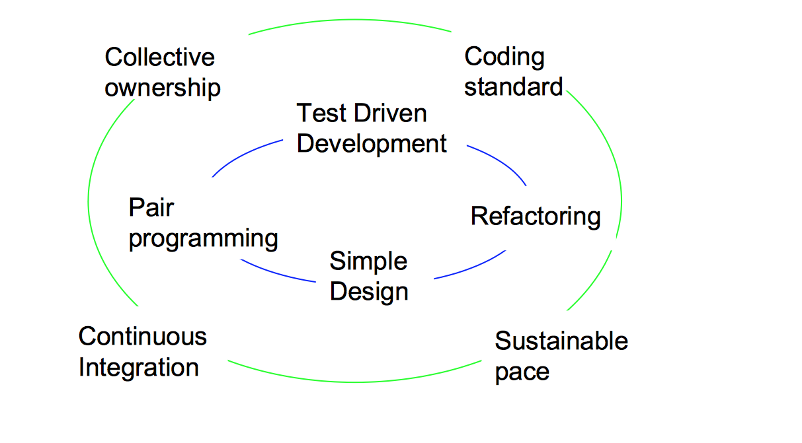
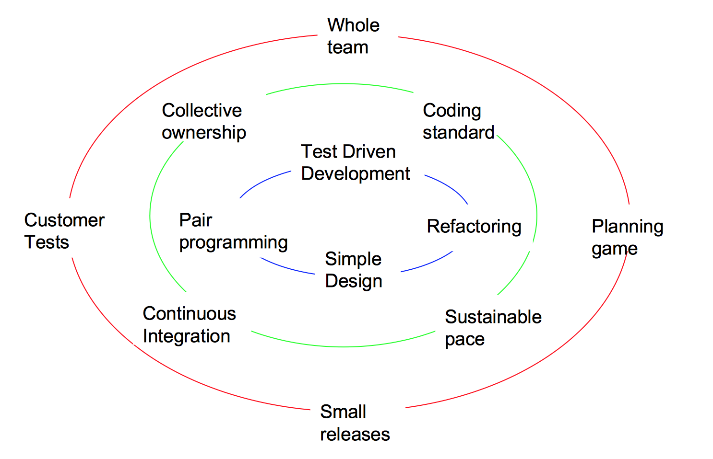

# Introduction to CompoZed XP Agile

Niall O'Gorman

---

### Compozed

Allstate’s internal effort, CompoZed, is a radical new way of thinking, acting and delivering software solutions to enhance the Allstate customer experience. 
The core services provided by CompoZed are product management, user experience design, Agile/ test driven software development and self-service infrastructure management. 

Note: 
Traditionally Allstate used waterfall development methodology to delivery software.  Compozed represents a change to include Agile methods - Scrum and XP.  This presentation will focus on Agile XP 

---

### Compozed XP Agile team structure

Note: Compozed has labs across the world.  In each lab multiple teams operate.  Every team is cross functional, comprising a product manager, developers and designer.

---

### XP Agile can seem a bit overwhelming intially

Note: 
XP Agile introduces many concepts which may be new to anyone who has worked exlusively with waterfall methodology.  

---

XP is an agile software development framework that aims to produce higher quality software and  higher quality of life for developers

Note: 
This summary statement goes to the heart of what XP intends to be.
To make sense of what can feel like a complicated jigsaw, let us look at the values, principles and practices which XP is founded on. 

---

### XP values, principle and practices

Note: 
The values can be thought of as somewhat abstract, the practices are specific processes, the principles then are the guidelines which bridge the abstract to the concrete

---

### XP values

- Communication <!-- .element: class="fragment" -->
 
- Simplicity <!-- .element: class="fragment" -->

- Feedback <!-- .element: class="fragment" -->

- Courage <!-- .element: class="fragment" -->

- Respect <!-- .element: class="fragment" -->

Note: 
Constantly communicate with users and team members, share knowledge at pair/team/lab level
Keep design simple and clean, design for today not an immagined tomorrow
Get feedback - from system testing from day one; from customer; from team at planning and retro
Courage - refactor continously, persistence to solve intractable problems;  respond to changing requirements and technology
Respect the team by celebrating sucess and giving honest and kind feedback, respect fellow developers by writing clean code and only commiting passing tests 

+++

### XP values

- Communication 
 
- Simplicity 

- Feedback 

- Courage 

- Respect 

---
### XP Principles

- Incremental Change <!-- .element: class="fragment" -->

- Quality <!-- .element: class="fragment" -->

- Humanity <!-- .element: class="fragment" -->

- Learning from failure <!-- .element: class="fragment" -->

- Accept responsibility <!-- .element: class="fragment" -->

Note:
XP teams embrace incremental change
Quality
Humanity - empathy

+++

### XP Principles

- Incremental Change 

- Quality 

- Humanity 

- Learning from failure 

- Accept responsibility 

---

### XP Practices

Note:
Paired programming - all production code produced by a pair, one has control and codes, the other has big picture and reviews; trade roles;two eyes better than one
TDD - write tests before code, minimal tests, red-green-refactor
Refactoring - look for duplicate code, implement clean coding practices
Keep design and code simple

+++

### XP Practices

Note:
Continous integration - team working on latest version of code, changes and improvements merged into the repository every few hours
Collective code ownership - everyone responsible for all the code, anyone can change anything, no “owners” or “heros”
Coding standard - agreed rules for entire team
Sustainable pace - developers work best when rested, should not work overtime, take regular breaks to refresh mind.  Well tested, continuously integrated and deployed code should minimize production outages and associated after-hours work

+++

### XP Practices

Note:
Planning or IPM - meeting once a week to plan release (what to deliver when) and iteration (developer activities)
Whole team - the user is part of the team
Small releases - delivery is incremental, help customer gain condfidence
Customer tests - 

---

### XP values, principle and practices

---

- https://compozed.allstate.com/wp-content/uploads/2016/03/CompoZed-key-messages_July-2016-1.pdf
